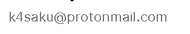

# argo
argo control sourcecode 
pls contact:
Core Argo floats
The Argo array is currently comprised of several float models:

ARVOR built by NKE-INSTRUMENTATION in France in close collaboration with IFREMER.  It’s predecessor is the PROVOR float.
APEX float produced by Teledyne Webb Research
SOLO-II which was designed and built by Scripps Institution of Oceanography.  It’s predecessor is the SOLO float.
S2A float is produced by MRV Systems in the USA who bought the rights to the SOLO-II and manufactures it under the rebranded name of the S2A float
NAVIS built by Sea-Bird in the USA
There are a handful of other floats used in Argo as well, but not in large numbers.  These include the NOVA, NEMO and HM2000 floats.  Pictures of floats are below.  Schematics are found here.

The SBE temperature/salinity sensor is now used almost exclusively on core Argo floats and is the only approved CTD. In the beginning, the FSI sensor was also used. Now there is an RBR CTD that is in the pilot phase.  The temperature data are accurate to a few millidegrees over the float lifetime. For discussion of salinity data accuracy please see the Data FAQ.  For more information on technical limitations for floats, click here.

AN ARVOR FLOAT COURTESY OF OLIVIER DUGORNAY AT IFREMER

AN APEX FLOAT COURTESY OF HOWARD FREELAND
